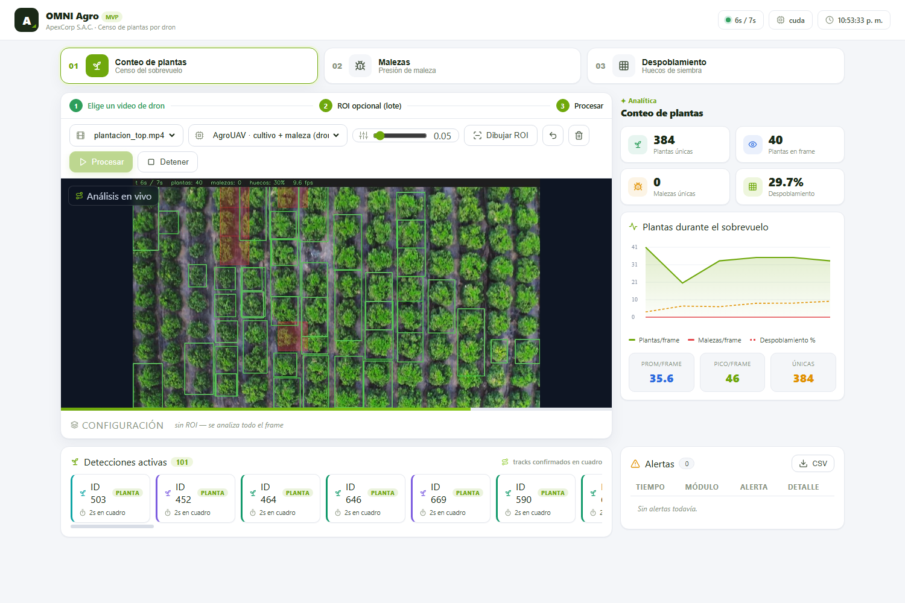
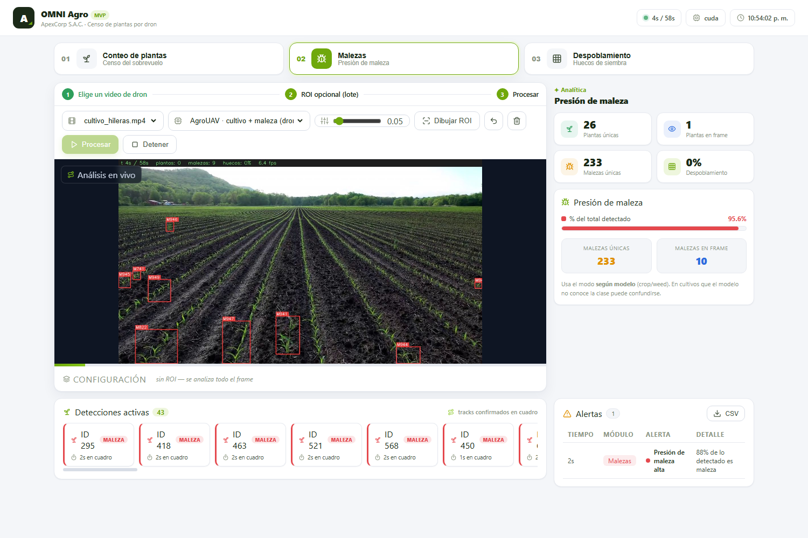
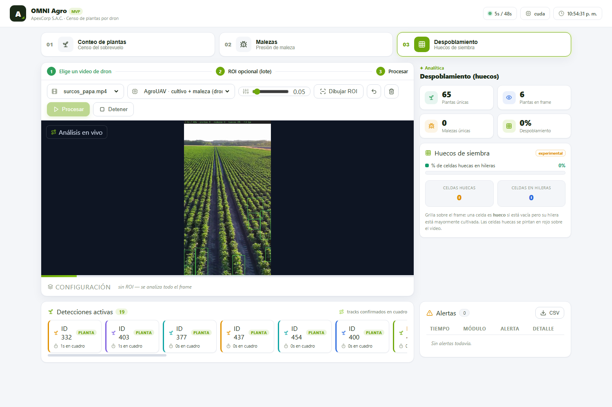
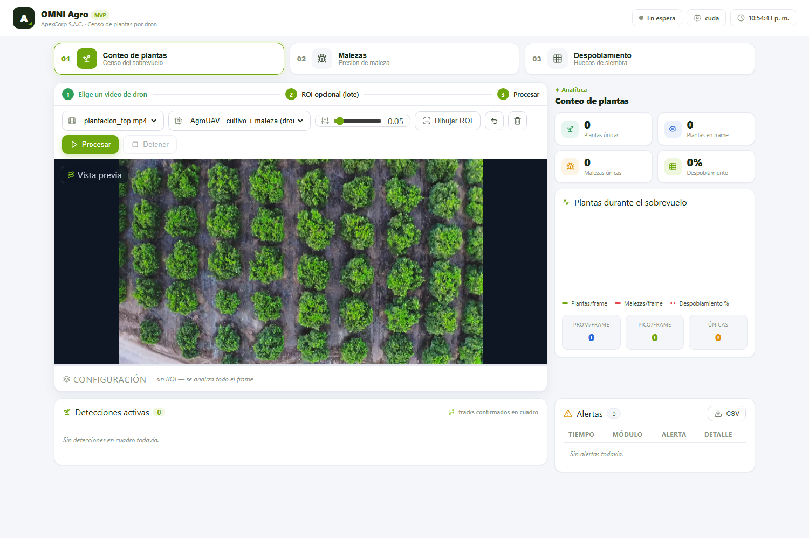
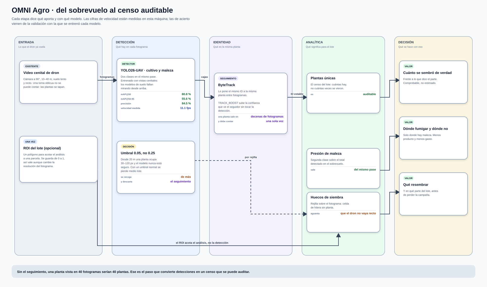
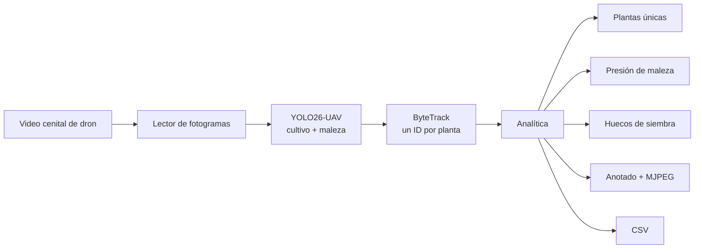

# OMNI Agro — censo de plantas por dron

> **Visión computacional · YOLO26-UAV + ByteTrack · FastAPI · CUDA o CPU**
>
> 
> 
> 
> 



## El problema

Contar plantas en campo se hace a mano, por muestreo, y el resultado es una
estimación que nadie puede comprobar. Lo mismo con los huecos de siembra y con
la maleza: se sabe que «hay bastante» en tal lote, y poco más.

El dron ya sobrevuela. OMNI Agro coge ese video y devuelve **tres cifras que se
pueden auditar**: cuántas plantas hay, qué porcentaje del surco está vacío y
cuánta presión de maleza tiene el lote.

| Módulo | Qué responde | Con qué |
|---|---|---|
| **Conteo** | ¿Cuántas plantas hay en el lote? | Detección por fotograma + ByteTrack para no contar la misma dos veces |
| **Malezas** | ¿Cuánta presión de maleza? | Segunda clase del mismo modelo, sobre el total detectado |
| **Despoblamiento** | ¿Qué parte del surco está vacía? | Rejilla sobre el fotograma; celdas de hilera sin planta |

## Qué se ve

| | |
|---|---|
| **Censo del sobrevuelo**<br><br><sub>384 plantas únicas y 29,7 % de despoblamiento sobre video real</sub> | **Presión de maleza**<br><br><sub>segunda clase del mismo modelo, sobre el total detectado</sub> |
| **Huecos de siembra**<br><br><sub>rejilla sobre el fotograma; celdas de hilera sin planta</sub> | **ROI del lote**<br><br><sub>opcional: acota el análisis a una parcela</sub> |

## Cómo funciona

<a href="docs/flujo.svg">
  
</a>

<sub>Ábrelo en grande: <a href="docs/flujo.svg"><code>docs/flujo.svg</code></a>.
Las cifras de las tarjetas no están escritas a mano — las pone
<a href="scripts/diagrama.py"><code>scripts/diagrama.py</code></a> leyendo
<code>docs/modelos.json</code>, que a su vez genera
<a href="scripts/medir_modelos.py"><code>scripts/medir_modelos.py</code></a>
midiendo los modelos de verdad. Si mañana se cambia un modelo, se corren los
dos y el dibujo se corrige solo.</sub>

### El mismo recorrido, en corto



**Por qué el seguimiento y no una simple suma.** Una planta aparece en decenas
de fotogramas seguidos. Sumar detecciones daría un número enorme y sin sentido;
el seguimiento le asigna un ID y la cuenta una sola vez. Ese es todo el truco
del censo, y también el error que no se ve: el video se procesa, sale un
número, y ese número está mal sin que nada falle.

**Por qué el umbral es `0.05` y no `0.25`.** Desde 20 metros una planta ocupa
30–120 píxeles y el modelo nunca está muy seguro. Con un umbral normal se
pierde la mitad del lote. Aquí interesa recoger de más y dejar que el
seguimiento descarte lo que no se sostiene entre fotogramas.

**Los huecos se miden por rejilla, no por distancia entre plantas.** Se divide
el fotograma en celdas; una celda de una hilera que ya tiene plantas a los
lados y ninguna dentro es un hueco. Aguanta que el dron no vuele perfectamente
recto, que es lo que pasa siempre.

<!-- MODELOS:inicio -->

### Qué tan bien detecta cada modelo

| Modelo | Para qué | Precisión | Recall | mAP@50 | mAP@50-95 | La cifra sale de |
|---|---|---|---|---|---|---|
| **`uav_weed_yolo26.pt`** | Cultivo y maleza desde el aire | 84.5 % | 71.1 % | 80.8 % | 55.6 % | el propio `.pt` |
| **`yolov8s-world.pt`** | Cultivos fuera del vocabulario del UAV | — | — | 52.0 % | 37.4 % | [su documentación](https://docs.ultralytics.com/models/yolo-world/)<br><sub>transferencia sin entrenamiento (zero-shot) sobre COCO</sub> |

<sub>Ninguna de estas cifras se calcula aquí, y la última columna dice cuál es cuál. <b>El propio <code>.pt</code></b>: Ultralytics guardó dentro del archivo la validación del entrenamiento que lo produjo, así que es el acierto que midió quien lo entrenó sobre <i>su</i> conjunto. <b>Su documentación</b>: ese archivo no guardó métricas, y se cita lo que publica su autor con enlace para comprobarlo. <b>No publicado</b>: no hay cifra en ninguna parte, y se dice en vez de rellenar el hueco.<br>En los tres casos son cifras sobre el conjunto de validación de quien entrenó, <b>no</b> sobre los videos de este proyecto. Medir eso exigiría etiquetar a mano esta operación concreta, que es trabajo que un MVP todavía no ha hecho; un porcentaje inventado sería peor que ninguno. Comprobación de que la lectura del <code>.pt</code> es correcta: <code>yolo11n</code> sale con mAP@50-95 = 39,4 % y Ultralytics publica 39,5 % para ese modelo en COCO.</sub>

### De dónde sale cada modelo

| Modelo | Entrenado sobre | Épocas | Resolución | Origen |
|---|---|---|---|---|
| **`uav_weed_yolo26.pt`** | `retrain_data` | 92 | 512×512 | Afinado sobre vistas cenitales de dron |
| **`yolov8s-world.pt`** | `—` | 100 | 640×640 | [Ultralytics YOLO-World](https://docs.ultralytics.com/models/yolo-world/) |

<sub>El conjunto, las épocas y la resolución salen de <code>train_args</code>, que Ultralytics guarda dentro del propio <code>.pt</code>. Es decir: no es lo que dice la ficha del modelo, es lo que quedó grabado en el archivo que este repositorio carga de verdad. Los nombres de conjunto son los del disco de quien entrenó —<code>retrain_data</code>, <code>safe_human</code>— porque es literalmente lo que hay dentro.</sub>

### Cuánto tarda cada uno, medido aquí

| Modelo | Parámetros | Clases | Latencia (mejor) | Latencia (mediana) | Umbral | Det./fotograma | Confianza media |
|---|---|---|---|---|---|---|---|
| **`uav_weed_yolo26.pt`** | 26.2 M | 2 | 81.5 ms · 12 fps | 98.9 ms · 10.1 fps | `0.05` | 71.4 | 0.176 |
| **`yolov8s-world.pt`** | 13.4 M | 80 | 17.9 ms · 56 fps | 21.0 ms · 47.5 fps | `0.05` | 1.7 | 0.105 |

<sub>Esto sí se mide aquí, con <a href="scripts/medir_modelos.py"><code>scripts/medir_modelos.py</code></a>, sobre fotogramas reales de los videos del repositorio, en una RTX 3060 Laptop y a la resolución que usa la aplicación. Sesenta fotogramas, descartando los veinte primeros. El umbral es el que usa la aplicación, y va en la tabla porque «det./fotograma» no significa nada sin él: el mismo modelo a 0.05 y a 0.50 devuelve cantidades incomparables. «Confianza media» es la media de la puntuación de lo que pasó ese umbral — no es acierto, pero dice si el modelo trabaja cómodo o al límite en este material.<br>Se dan <b>dos</b> latencias a propósito. Esta GPU está a 210 MHz en reposo y tarda segundos en subir de reloj, así que la mediana se mueve bastante entre pasadas —el mismo <code>yolo11n</code> ha dado 20 y 48 fps— mientras que el mejor caso es estable y representa lo que la máquina puede sostener. Dar solo la cifra buena sería vender de más; dar solo la mediana, castigar al modelo por la gestión de energía del portátil.</sub>

### Los umbrales que usa este proyecto

Una cifra de mAP sin el umbral al que se trabaja no dice nada: el mismo modelo a 0.05 y a 0.50 se comporta como dos modelos distintos. Estos son los valores por defecto, todos cambiables por variable de entorno sin tocar código.

| Umbral | Valor | Por qué ese y no otro |
|---|---|---|
| Confianza · cultivo y maleza | **`0.05`** | Desde 20 m una planta ocupa 30–120 px y el modelo nunca está seguro. Con un umbral normal se pierde medio lote. Se recoge de más y el seguimiento descarta lo que no se sostiene entre fotogramas. |
| Activación de ByteTrack | **`0.05`** | Igual de bajo, por lo mismo. Un umbral de seguimiento normal tiraría justo las detecciones flojas que aquí son la mayoría. |
| TRACK_BOOST | **`sí`** | Sube la confianza que VE el seguidor sin tocar la detección. Deja elegir por separado qué se detecta y qué merece un ID. |

<!-- MODELOS:fin -->

## Probarlo

```bash
pip install -r requirements.txt
python download_models.py
python -m uvicorn backend.main:app --port 8020    # o arrancar.bat
```

### Por qué los pesos y los videos no están aquí

No son código: son la entrada y la salida del sistema. Varios pasan de los
100 MB que GitHub rechaza de plano, y clonar el proyecto pasaría de segundos a
minutos para traerse archivos que se regeneran o se descargan.

```bash
python download_models.py          # los recupera y dice cuáles faltan
```

## Cómo está montado

```
backend/
├── config.py     todo por variable de entorno
├── detector.py   modelos cargados solo cuando se usan
├── processor.py  el bucle: leer, detectar, seguir, anotar, emitir
├── analytics.py  detecciones → censo, maleza y huecos
├── zones.py      ROI opcional del lote
└── main.py       API y streaming MJPEG
frontend/         interfaz sin framework
scripts/          generadores de las capturas y del diagrama de ramas
run_video.py      procesa un video entero a archivo, sin navegador
```

## Ajustes (`.env`)

| Clave | Para qué |
|---|---|
| `DEVICE` | `cuda` o `cpu` |
| `DEFAULT_CONF` | Confianza — `0.05` a propósito, ver arriba |
| `TRACK_BOOST` | Sube la confianza que ve ByteTrack sin tocar la detección |
| `WORK_RES` | Resolución de inferencia |
| `GAP_ALERT_PCT` | Despoblamiento que dispara alerta |

## Pruebas

```bash
python -m pytest -q
```

Quince comprobaciones en cuatro bloques: que la config carga y los pesos están,
que el detector no se inventa plantas ante un fotograma vacío, que la analítica
cuenta las plantas únicas de una hilera sintética, encuentra el hueco que se le
dejó a propósito y **dispara la alerta de despoblamiento**, y que una pasada
real de 60 fotogramas deja el MP4 anotado y el CSV con su resumen.

Lo que falta por no venir en el repositorio —pesos, videos— se **salta**, no se
da por bueno. Y un fallo rompe la suite: antes se imprimía «✗» y pytest seguía
en verde, que es peor que no tener pruebas.

<!-- GITFLOW:inicio -->

## Cómo se trabajó

**20 commits**, **12 fusiones** y **4 etiquetas** (`v0.1.0`, `v0.2.0`, `v0.3.0`, `v0.4.0`). al generar este bloque. Cada rama entra con `--no-ff`: un merge aplastado ahorra una línea y borra la única prueba de que aquello fue una tarea con principio y final.

```mermaid
gitGraph
   commit id: "import"
   branch develop
   checkout develop
   branch feature/repository-hygiene
   checkout feature/repository-hygiene
   commit
   checkout develop
   merge feature/repository-hygiene
   checkout main
   merge develop tag: "v0.1.0"
   checkout develop
   branch feature/portable-paths-and-docs
   checkout feature/portable-paths-and-docs
   commit
   checkout develop
   merge feature/portable-paths-and-docs
   checkout main
   merge develop tag: "v0.2.0"
   checkout develop
   branch feature/documentation
   checkout feature/documentation
   commit
   checkout develop
   merge feature/documentation
   checkout main
   merge develop tag: "v0.3.0"
   checkout main
   merge develop tag: "v0.4.0"
   checkout develop
   branch feature/pipeline-diagram-and-model-metrics
   checkout feature/pipeline-diagram-and-model-metrics
   commit
   checkout develop
   merge feature/pipeline-diagram-and-model-metrics
   checkout main
   merge develop
   checkout develop
   branch main
   checkout main
   commit
   checkout develop
   merge main
   checkout develop
   branch feature/documented-metrics-and-thresholds
   checkout feature/documented-metrics-and-thresholds
   commit
   checkout develop
   merge feature/documented-metrics-and-thresholds
   checkout main
   merge develop
```

| Prefijo | Para qué | Ramas |
|---|---|---|
| `develop/` | rama de integración | 6 |
| `feature/` | trabajo acotado, se integra en develop | 5 |
| `main/` | otros | 1 |

| Rama | Responsabilidad | Regla de salida |
|---|---|---|
| `main` | Lo que ve primero quien llega al repositorio | Solo recibe trabajo terminado y con las pruebas en verde |
| `develop` | Integración: aquí se junta todo antes de subir | Merge `--no-ff` desde una rama `feature/*` |
| `feature/*` | Un trabajo acotado, nombrado por lo que hace | Merge `--no-ff` a `develop` con sus pruebas escritas |

Los mensajes siguen *Conventional Commits* y están en inglés. Explican **por qué**, no qué: el *qué* ya está en el diff. Varios cuentan el fallo que arreglan y cómo se descubrió, que es lo que sirve dentro de seis meses.

<sub>El diagrama lo genera <a href="scripts/gitflow.py"><code>scripts/gitflow.py</code></a> leyendo <code>git log --merges</code>.</sub>

<!-- GITFLOW:fin -->

---

## Licencia

Uso interno de ApexCorp S.A.C.

<sub>OMNI Agro · ApexCorp S.A.C. — desarrollado por
<a href="https://github.com/danielyatacoblas">Daniel Yataco Blas</a></sub>
