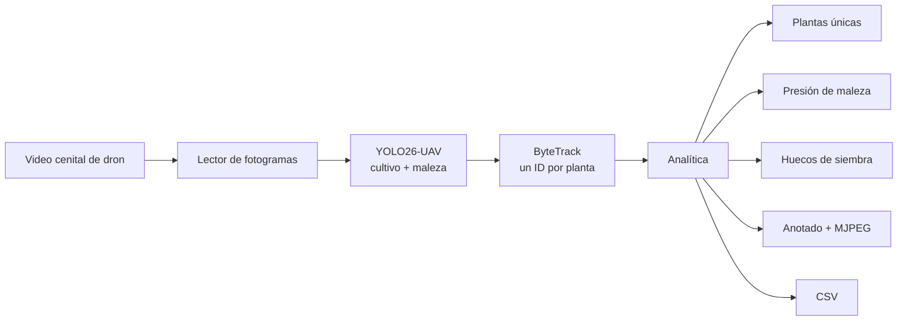
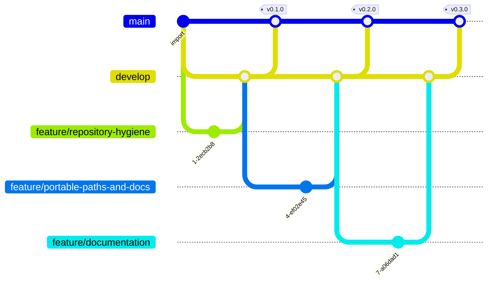

# OMNI Agro — censo de plantas por dron

> **Visión computacional · YOLO26-UAV + ByteTrack · FastAPI · CUDA o CPU**
>
> 
> 
> 
> 


## El problema

Contar plantas en campo se hace a mano, por muestreo, y el resultado es una
estimación que nadie puede comprobar. Lo mismo con los huecos de siembra y con
la maleza: se sabe que «hay bastante» en tal lote, y poco más.

El dron ya sobrevuela. OMNI Agro coge ese video y devuelve **tres cifras que se
pueden auditar**: cuántas plantas hay, qué porcentaje del surco está vacío y
cuánta presión de maleza tiene el lote.

| Módulo | Qué responde | Con qué |
|---|---|---|
| **Conteo** | ¿Cuántas plantas hay en el lote? | Detección por fotograma + ByteTrack para no contar la misma dos veces |
| **Malezas** | ¿Cuánta presión de maleza? | Segunda clase del mismo modelo, sobre el total detectado |
| **Despoblamiento** | ¿Qué parte del surco está vacía? | Rejilla sobre el fotograma; celdas de hilera sin planta |

## Qué se ve

| | |
|---|---|
| **Censo del sobrevuelo**<br><br><sub>384 plantas únicas y 29,7 % de despoblamiento sobre video real</sub> | **Presión de maleza**<br><br><sub>segunda clase del mismo modelo, sobre el total detectado</sub> |
| **Huecos de siembra**<br><br><sub>rejilla sobre el fotograma; celdas de hilera sin planta</sub> | **ROI del lote**<br><br><sub>opcional: acota el análisis a una parcela</sub> |

## Cómo funciona



**Por qué el seguimiento y no una simple suma.** Una planta aparece en decenas
de fotogramas seguidos. Sumar detecciones daría un número enorme y sin sentido;
el seguimiento le asigna un ID y la cuenta una sola vez. Ese es todo el truco
del censo, y también el error que no se ve: el video se procesa, sale un
número, y ese número está mal sin que nada falle.

**Por qué el umbral es `0.05` y no `0.25`.** Desde 20 metros una planta ocupa
30–120 píxeles y el modelo nunca está muy seguro. Con un umbral normal se
pierde la mitad del lote. Aquí interesa recoger de más y dejar que el
seguimiento descarte lo que no se sostiene entre fotogramas.

**Los huecos se miden por rejilla, no por distancia entre plantas.** Se divide
el fotograma en celdas; una celda de una hilera que ya tiene plantas a los
lados y ninguna dentro es un hueco. Aguanta que el dron no vuele perfectamente
recto, que es lo que pasa siempre.

### El modelo

| Modelo | Para qué | Por qué |
|---|---|---|
| **YOLO26-UAV** (`uav_weed_yolo26.pt`) | Cultivo y maleza desde el aire | Entrenado con vistas cenitales; los modelos de suelo fallan desde arriba |
| **YOLO-World** | Cultivos raros | Vocabulario abierto para lo que el modelo UAV no cubre |

> **Solo sirve video cenital.** Cámara mirando 90° hacia abajo, 10–40 m de
> altura, vuelo lento y recto. Una toma oblicua al horizonte no se puede contar
> — las plantas se solapan unas con otras y el conteo pierde todo el sentido.
> En [`docs/videos-de-prueba.md`](docs/videos-de-prueba.md) están los prompts
> para generar videos válidos con IA.

## Probarlo

```bash
pip install -r requirements.txt
python download_models.py
python -m uvicorn backend.main:app --port 8020    # o arrancar.bat
```

### Por qué los pesos y los videos no están aquí

No son código: son la entrada y la salida del sistema. Varios pasan de los
100 MB que GitHub rechaza de plano, y clonar el proyecto pasaría de segundos a
minutos para traerse archivos que se regeneran o se descargan.

```bash
python download_models.py          # los recupera y dice cuáles faltan
```

## Cómo está montado

```
backend/
├── config.py     todo por variable de entorno
├── detector.py   modelos cargados solo cuando se usan
├── processor.py  el bucle: leer, detectar, seguir, anotar, emitir
├── analytics.py  detecciones → censo, maleza y huecos
├── zones.py      ROI opcional del lote
└── main.py       API y streaming MJPEG
frontend/         interfaz sin framework
scripts/          generadores de las capturas y del diagrama de ramas
run_video.py      procesa un video entero a archivo, sin navegador
```

## Ajustes (`.env`)

| Clave | Para qué |
|---|---|
| `DEVICE` | `cuda` o `cpu` |
| `DEFAULT_CONF` | Confianza — `0.05` a propósito, ver arriba |
| `TRACK_BOOST` | Sube la confianza que ve ByteTrack sin tocar la detección |
| `WORK_RES` | Resolución de inferencia |
| `GAP_ALERT_PCT` | Despoblamiento que dispara alerta |

## Pruebas

```bash
python -m pytest -q
```

Quince comprobaciones en cuatro bloques: que la config carga y los pesos están,
que el detector no se inventa plantas ante un fotograma vacío, que la analítica
cuenta las plantas únicas de una hilera sintética, encuentra el hueco que se le
dejó a propósito y **dispara la alerta de despoblamiento**, y que una pasada
real de 60 fotogramas deja el MP4 anotado y el CSV con su resumen.

Lo que falta por no venir en el repositorio —pesos, videos— se **salta**, no se
da por bueno. Y un fallo rompe la suite: antes se imprimía «✗» y pytest seguía
en verde, que es peor que no tener pruebas.

<!-- GITFLOW:inicio -->

## Cómo se trabajó

**10 commits**, **6 fusiones** y **3 etiquetas** (`v0.1.0`, `v0.2.0`, `v0.3.0`). al generar este bloque. Cada rama entra con `--no-ff`: un merge aplastado ahorra una línea y borra la única prueba de que aquello fue una tarea con principio y final.



| Prefijo | Para qué | Ramas |
|---|---|---|
| `feature/` | trabajo acotado, se integra en develop | 3 |
| `develop/` | rama de integración | 3 |

| Rama | Responsabilidad | Regla de salida |
|---|---|---|
| `main` | Lo que ve primero quien llega al repositorio | Solo recibe trabajo terminado y con las pruebas en verde |
| `develop` | Integración: aquí se junta todo antes de subir | Merge `--no-ff` desde una rama `feature/*` |
| `feature/*` | Un trabajo acotado, nombrado por lo que hace | Merge `--no-ff` a `develop` con sus pruebas escritas |

Los mensajes siguen *Conventional Commits* y están en inglés. Explican **por qué**, no qué: el *qué* ya está en el diff. Varios cuentan el fallo que arreglan y cómo se descubrió, que es lo que sirve dentro de seis meses.

<sub>El diagrama lo genera <a href="scripts/gitflow.py"><code>scripts/gitflow.py</code></a> leyendo <code>git log --merges</code>.</sub>

<!-- GITFLOW:fin -->

---

## Licencia

Uso interno de ApexCorp S.A.C.

<sub>OMNI Agro · ApexCorp S.A.C. — desarrollado por
<a href="https://github.com/danielyatacoblas">Daniel Yataco Blas</a></sub>
